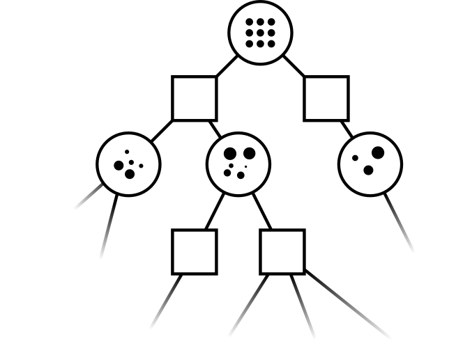

# Theory

## The Partially Observable Markov Decision Process

\begin{minipage}[t]{0.59\textwidth}
    \textbf{Dynamic Decision Network}

    \hspace{-20pt}
    \begin{figure}[htpb]
        \begin{overprint}
            \onslide<1>\centering\includegraphics[width=0.8\textwidth]{media/pomdp/pomdp-mdp-gray-ddn.pdf}
            \onslide<2->\centering\includegraphics[width=0.8\textwidth]{media/pomdp/pomdp_ddn.pdf}
        \end{overprint}
    \end{figure}
\end{minipage}
\begin{minipage}[t]{0.39\textwidth}
    \textbf{\onslide<2->{PO}\onslide<1->{MDP}}
    \vspace{10pt}
    \begin{itemize}[<1->]
            \item state $s$
            \item action $a$
            \item reward $r$
    \end{itemize}
    \begin{itemize}[<2->]
            \item observation $o$
            \item initial belief $b_0$
    \end{itemize}
\end{minipage}
**Objective**: Finding a policy $\pi^*$ that maximizes
$$
J(\pi) = E\left[\sum_{t=0}^\infty \gamma^t r_t)\right] \text{.}
$$

\note{\itodo{test}}
\note[item]{Partially observed MDP: MDP at its core and state inferred through observations}
\note[item]{explain all parts: state, action, reward ...}
\note[item]{MDP: state obeys the \emph{Markov Property}}
\note[item]{Allows to model two types of uncertainty: \textbf{state
            uncertainty} (state is not known exactly but indirectly observed) and
            \textbf{outcome uncertainty} (e.g. dynamics not exactly known)}

## Determinized Sparse Partially Observable Tree (DESPOT)

[columns]

[column=0.4]

{width="100%"}

[column=0.6]

**Characteristics**

- determinized scenarios
- regularization
- maintain bounds on the \emph{value}, $V^\ast$

\vspace{10pt}
**High Level Idea**

- tighten bounds at the root
- choose action with best lower bound

[/columns]

\pause
\vspace{5pt}
**Algorithm**

:::: {.columns}

::: {.column width="33%"}

1. Search

\small
- traverse tree to a promising leaf

:::

\pause
\vline
::: {.column width="33%"}

2. Expansion

\small
- initialize new nodes with **user defined heuristic bounds**

:::

\pause
\vline
::: {.column width="33%"}

3. Backup

\small
- update bounds on path to the root

:::

::::

\note{Exploration}
\note[item]{actions: highest upper bound on value}
\note[item]{observation: highest excess uncertainty}

## Partially Observable Monte-Carlo Planning with Observation Widening (POMCPOW)

[columns]

[column=0.4]

[column=0.6]

**Characteristics**

- weighted particle beliefs
- progressive widening
- value estimate at the leaf

\vspace{10pt}
**High Level Idea**

- locally approximate the \emph{value function} through Monte-Carlo simulations
- choose action with highest value

[/columns]

**Algorithm**

:::: {.columns}

::: {.column width="33%"}

1. Search

\small
- traverse tree to a promising leaf

:::

\pause
\vline
::: {.column width="33%"}

2. Expansion

\small
- initialize value with **user defined value estimate**

:::

\pause
\vline
::: {.column width="33%"}

4. Backup

\small
- update value-estimate on the path to root

:::

::::

\note{\textbf{DESPOT}}
\note[item]{Sequentially constructs a DESPOT by simulating a fixed set of scenarios.}
\note[item]{Uses upper bounds to guide the search (heuristic) and lower bounds for regularization and pruning}

\note{\textbf{POMCPOW}}
\note[item]{MCTS with value estimate and double progressive widening (there won't be time to explain double progressive widening)}
